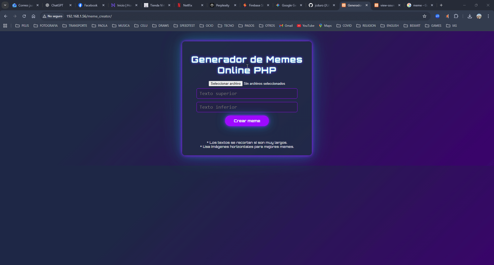

# 🤣 Generador de Memes en PHP Puro

---

## ✨ Descripción

Este es un proyecto web en PHP puro que permite crear memes personalizados en el clásico estilo "disaster girl":
- El usuario sube una imagen (JPG/PNG).
- Escribe texto para la parte superior y/o inferior.
- El resultado se muestra en pantalla y se puede descargar.

## ✨ Vista previa



--- 

## 📝 Características

- PHP puro, sin frameworks ni dependencias externas (solo GD).
- Permite subir imágenes PNG/JPG.
- Añade texto superior/inferior con fuente tipo meme (Impact.ttf).
- Efecto de borde negro y centrado para mejor legibilidad.
- Interfaz con CSS moderno, botón destacado y fondo cool.
- Visualización directa y descarga del meme final.

---

## 🚀 Instalación rápida

1. **Requisitos:**
   - PHP >= 7.x con extensión GD activada.
   - Servidor local (XAMPP, WAMP, Laragon, etc.).
   - Archivo `impact.ttf` (fuente meme, ver abajo) en la carpeta del proyecto.

2. **Activar extensión GD en PHP:**
   - Abre tu archivo `php.ini` (`C:\xampp\php\php.ini` en XAMPP).
   - Busca la línea:
     ```
     ;extension=gd
     ```
     y elimínale el punto y coma:
     ```
     extension=gd
     ```
   - Guarda y **reinicia Apache** para activar.

3. **Agregar la fuente Impact.ttf:**
   - Descarga la fuente gratis en [DaFont: Impact](https://www.dafont.com/impact.font) o [Google Fonts: Impact](https://fonts.google.com/specimen/Impact).
   - Coloca el archivo `impact.ttf` en la misma carpeta que tu `index.php`.

4. **Ejecuta el proyecto:**
   - Coloca los archivos en la carpeta pública de tu servidor local (`htdocs` o similar).
   - Abre en tu navegador:  
     ```
     http://localhost/meme_creator/
     ```

---

## 💡 Uso

1. Sube una imagen (JPG/PNG).
2. Escribe los textos para la parte superior/inferior.
3. Haz clic en “Crear meme”.
4. Descarga el resultado con el botón “Descargar meme”.

---

## 🔧 Personalización

- Puedes cambiar la fuente, tamaño, color o estilo modificando el código PHP y los valores CSS.
- El texto se convierte automáticamente a mayúsculas y se centra para el estilo clásico de memes.

---

## 📝 Ejemplo de textos para el meme

- Arriba: “Cuando tu jefe pide otro informe urgente”
- Abajo: “Pero tú ya lo has quemado todo por dentro”

O el clásico:

- Arriba: “Todo está bajo control”
- Abajo: “(Control: Alt + Del)”

---

## 🛠️ Solución de errores comunes

- **"Invalid font filename"**: Verifica que `impact.ttf` exista en la carpeta y que el nombre sea exacto.
- **No aparecen los textos**: Asegúrate de que la extensión GD esté activa y la fuente disponible.
- **No acepta la imagen**: Solo acepta imágenes JPG y PNG.

---

## 📊 Lenguajes y Herramientas

[](https://skillicons.dev)

---

## 👤 Autor

Juan Carlos Chaparro  
GitHub: [@jcduro](https://github.com/jcduro)

---

## 📄 Licencia

Código abierto para uso libre, educativo y personal.

---


